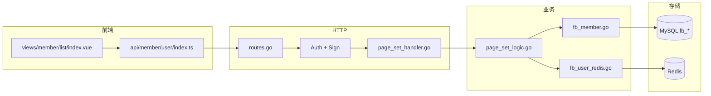

# 接口代码跟读指南（Onboarding）

本文说明如何在 Ovra-Zero 仓库中**从 HTTP 请求一路跟到数据库/Redis**，并以 **`GET /member/user/list`**、**`GET /member/user/stats`** 为完整示例。学会这一条链路后，其他业务接口（`/fund/*`、`/trade/*` 等）可按同一套分层类推。

> 本地启动、端口、前后端代理见 [local-dev.md](./local-dev.md)。接口字段与 JSON 示例见 [biz-api.md](./biz-api.md)。

---

## 1. 先搞清楚「接口契约」在哪

建议按下面顺序读，**不要一上来就翻 Logic**：

| 顺序 | 文件 | 看什么 |
| --- | --- | --- |
| 1 | [biz-api.md](./biz-api.md) §1.1 / 1.2 | 对外 URL、查询参数、响应字段含义 |
| 2 | `desc/system/api/member/user.api` | **契约源文件**（改接口先改这里） |
| 3 | `app/system/internal/types/types.go` | 由 `.api` 生成的 Go 请求/响应结构体 |

`user.api` 片段（路由与前缀在此定义）：

```api
@server(
    prefix: /member/user
    middleware: Auth, Sign
)
service System {
    @handler Stats
    get /stats (MemberUserQuery) returns (MemberUserStatsResp)

    @handler PageSet
    get /list (PageSetMemberUserReq) returns (PageSetMemberUserResp)
}
```

含义：

- 完整路径：`GET /member/user/list`、`GET /member/user/stats`
- 服务：**system**（本地默认 `http://127.0.0.1:8086`）
- 中间件：**Auth**（Token）、**Sign**（验签）
- `@handler PageSet` → 生成 `PageSetHandler` + `PageSetLogic` 骨架

修改 `.api` 后执行：

```bash
make api-system
```

会同步 `types.go`、`handler/routes.go`、Handler 文件；**Logic / DAL 需手写维护**，不会被覆盖业务实现。

类型注释约定见 `app/system/internal/types/member_doc.go`（勿手改 `types.go` 中的生成注释）。

---

## 2. 服务入口与路由注册

### 2.1 程序入口

`app/system/system.go` 的 `main()`：

1. 加载 `etc/{ENV}/system.yaml`（默认 `ENV=dev`）
2. `svc.NewServiceContext(c)` — 初始化 DB、Redis、中间件、DAL
3. `handler.RegisterHandlers(server, ctx)` — 注册全部 HTTP 路由

### 2.2 共享上下文 ServiceContext

`app/system/internal/svc/service_context.go`：

| 字段 | 用途 |
| --- | --- |
| `Db` | GORM 连接 MySQL |
| `Rds` | go-zero Redis 客户端 |
| `Auth` / `Sign` | 路由级中间件 |
| `Dal` | 数据访问层入口（`FbMemberDal`、`FbUserRedisDal` 等） |

Logic 中通过 `l.svcCtx.Dal.*` 访问数据，不直接 new 数据库连接。

### 2.3 HTTP 路由表

`app/system/internal/handler/routes.go`（goctl 生成，搜索 `/member/user`）：

```text
GET /member/user/stats  → memberuser.StatsHandler
GET /member/user/list   → memberuser.PageSetHandler
前缀：rest.WithPrefix("/member/user")
中间件：serverCtx.Auth, serverCtx.Sign
```

请求示例：

```http
GET /member/user/list?pageNum=1&pageSize=10&deleted=0
Authorization: Bearer <access_token>
```

---

## 3. 固定分层（全项目通用）

```text
desc/system/api/*.api          ← 契约（人工维护）
        ↓ make api-system
types.go + routes.go + handler/*_handler.go   ← 生成/骨架
        ↓ 手写
logic/*_logic.go               ← 业务编排（最常改）
        ↓
dal/*.go                       ← SQL / Redis
        ↓
MySQL / Redis
```

| 层 | 职责 | 不该写 |
| --- | --- | --- |
| **Handler** | 解析 query/body、调 Logic、写 JSON | 业务判断、SQL |
| **Logic** | 流程编排、类型映射、调用多个 Dal | 裸 SQL、HTTP 细节 |
| **DAL** | 查询/聚合、Redis key 封装 | HTTP、鉴权 |

前端（可选反向追踪）：

```text
views/member/list/index.vue
  → api/member/user/index.ts（路径 /member/user/list）
  → Vite 代理 `/api` → Traefik `28080` → system:8086
```

---

## 4. 示例 A：`GET /member/user/list` 全链路



### 跟读清单（IDE 中依次跳转）

| 步 | 文件 | 关注点 |
| --- | --- | --- |
| 1 | `docs/biz-api.md` §1.1 | 参数 `keyword` / `authStatus` / `deleted`、响应 `rows[]` 字段 |
| 2 | `desc/system/api/member/user.api` | `PageSetMemberUserReq`、`MemberUserItem` 定义 |
| 3 | `handler/routes.go` | 确认 `GET /list` → `PageSetHandler` |
| 4 | `handler/member/user/page_set_handler.go` | `httpx.Parse` 绑定 query → `PageSetLogic.PageSet` |
| 5 | `types/types.go` | `PageSetMemberUserReq`、`MemberUserItem` 结构 |
| 6 | `logic/member/user/page_set_logic.go` | **主流程**：Dal 调用 + 映射返回 |
| 7 | `dal/fb_member.go` → `PageUsers` | SQL：USD 钱包、投信持仓、`userWhere` 筛选 |
| 8 | `dal/fb_user_redis.go` → `BatchOnlineStatus` | `onlineStatus`：token 在线或 5 分钟 presence |

### Handler（薄层）

`page_set_handler.go` 只做三件事：解析 → 调 Logic → `OkJson` / `Error`。

### Logic（编排）

`page_set_logic.go` 典型步骤：

1. `req` → `dal.MemberListFilter`
2. `FbMemberDal.PageUsers` — MySQL 分页 + 聚合
3. 收集本页 `userIDs` → `FbUserRedisDal.BatchOnlineStatus`
4. 行数据映射为 `types.MemberUserItem` 返回

### DAL（数据）

| 方法 | 数据源 | 说明 |
| --- | --- | --- |
| `PageUsers` | MySQL | `fb_users` + USD 钱包子查询 + 投信 `profit_log` 分红 |
| `BatchOnlineStatus` | Redis | `online:user:{id}` 或 `fb:presence:active` 近 5 分钟 |

`FbMemberDal` / `FbUserRedisDal` 在 `dal/dal.go` 注册，构造时注入 `db` 与 `rds`。

### 响应形态

含 `rows` 的列表响应由 `toolkit/helper` **展平**到顶层（`total`、`rows` 不在 `data` 内），详见 [biz-api.md](./biz-api.md)「分页列表响应结构」。

---

## 5. 示例 B：`GET /member/user/stats`（更短）

| 步 | 文件 |
| --- | --- |
| 契约 | `user.api` → `MemberUserStatsResp` |
| 路由 | `routes.go` → `StatsHandler` |
| Handler | `stats_handler.go` |
| Logic | `stats_logic.go` → `FbUserRedisDal.OnlineStatistics` |
| DAL | `fb_user_redis.go` |

三项统计均为 **Redis 全局**，**不**随列表 `keyword` / `authStatus` 筛选变化：

| 响应字段 | Redis |
| --- | --- |
| `totalOnlineUsers` | `KEYS online:user:*` |
| `todayLogins` | `SCARD login:today` |
| `totalActiveSessions` | ZSET `fb:presence:active` 近 5 分钟 |

本接口**不走 MySQL**，Logic 通常只有一行 Dal 调用。

---

## 6. 如何类推其他接口

在 `desc/system/api/` 找到对应 `.api`（如 `fund/withdraw.api`），然后：

```text
.api 里的 @handler 名
  → routes.go 搜 Handler 函数名
  → handler/<group>/<handler>_handler.go
  → logic/<group>/<handler>_logic.go
  → dal/*.go（若已接真实表）
```

占位接口（返回空列表）的 Logic 里常有「业务表尚未接入」类注释，DAL 可能尚未实现。

接口总览表见 [biz-api.md](./biz-api.md)「接口总览」。

---

## 7. 本地验证（需先登录）

前提：按 [local-dev.md](./local-dev.md) 启动 **etcd → system → auth**，MySQL/Redis 配置正确。

```bash
# 1. 登录拿 Token（tenantId、clientId 按环境调整，默认管理员 admin/admin123）
curl -s -X POST 'http://127.0.0.1:8085/auth/login' \
  -H 'Content-Type: application/json' \
  -d '{"username":"admin","password":"admin123","tenantId":"000000","clientId":"e5cd7e4891bf95d1d19206ce24a7b32e","grantType":"password"}'

# 2. 用户列表
curl -s 'http://127.0.0.1:8086/member/user/list?pageNum=1&pageSize=10&deleted=0' \
  -H "Authorization: Bearer <access_token>"

# 3. 活跃统计（无查询参数）
curl -s 'http://127.0.0.1:8086/member/user/stats' \
  -H "Authorization: Bearer <access_token>"
```

在线/活跃统计需与业务 App **共用同一 Redis** 实例，联调时才有非零数据。

---

## 8. 常见改动落在哪一层

| 需求 | 改哪里 |
| --- | --- |
| 增删改 URL、请求/响应字段 | `desc/system/api/*.api` → `make api-system` |
| 调整业务流程（多表组合、缓存） | `logic/*_logic.go` |
| 改 SQL、筛选条件、Redis key | `dal/*.go` |
| 仅文档/示例 JSON | `docs/biz-api.md` |
| 前端表格列、筛选项 | `ruoyi-plus-vben5/.../views/`、`api/` |

---

## 相关文档

- [本地开发：配置与启动](./local-dev.md)
- [业务 API 接口文档](./biz-api.md)
- [代码注释与 CHANGELOG 规范](../.cursor/rules/code-comments-changelog.mdc)
